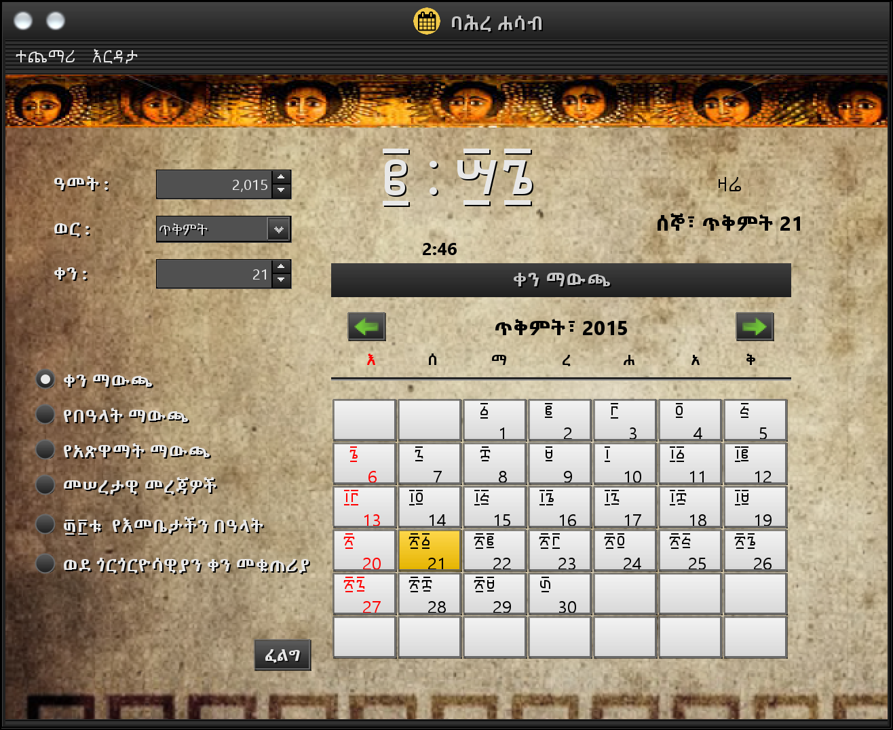

# ባህረ ሐሳብ
## የኢትዮጵያ ዘመን መቁጠሪያ የዴስክቶፕ መተግበሪያ
[Read in English](README.md)

ይህ የባህረ ሐሳብ ፕሮጀክት ተማሪ እያለሁ በትርፍ ጊዜ የሠራሁት ነው። ያኔ ተማሪ እያለሁ የዴስክቶፕ መተግበሪያዎችን መሥራት እወድ ነበር ። በ2008 ዓም የመጀመሪያውን ዕትም ከሠራሁ በኋላ በዓመቱ በ2009 የተወሰኑ ማሻሻያዎች አድርጌለት ነበር ግን ከዚያ በኋላ ምንም አይነት ለውጦች አልተደረጉለትም።

ወደ GitHub አሁን ሳመጣው እንዲሻሻሉ የምፈልጋቸው ነገሮች ቢኖሩም እንዲሁ እንዳለ ወደ ሰው መልቀቁን መርጫለሁ። ከእናንተ የሚደረጉ ማሻሸያዎች ካሉ ወደፊት እያስተካከልነው እንዲቀጥል እናደርጋለን። 

ይህ መተግበሪያ የተሠራው በ [NetBeans GUI builder](https://netbeans.apache.org/kb/docs/java/quickstart-gui.html) ነው።

በዓላት፣ እና የአጽዋማት መግቢያዎች የሚሰሉት በባህረ ሐሳብ ቀመር መሠረት ሲሆን ይህም የባህረ ሐሳብ ቀመር በ3ኛው ክፍለዘመን የቅብጥ ጳጳስ በነበረው [በቅዱስ ድሜጥሮስ](https://eotcmk.org/a/%E1%8B%95%E1%88%A8%E1%8D%8D%E1%89%B1-%E1%88%88%E1%88%8A%E1%89%80-%E1%8C%B3%E1%8C%B3%E1%88%B5-%E1%8A%A0%E1%89%A3-%E1%8B%B5%E1%88%9C%E1%8C%A5%E1%88%AE%E1%88%B5/) የተዘጋጀ ነው።

## አገልግሎቶች

- የኢትዮጵያ ዘመን መቁጠሪያ (በወራት የተከፋፈለ) 
- በኢትዮጵያ ኦርቶዶክስ ተዋህዶ ቤተክርስቲያን የሚከበሩትን የጌታን ዐበይትና ንዑሳን በዓላትን የሚያሳይ (የእንኳን አደረሳችሁ መልእክት የሚያሳይ)
- በኢትዮጵያ ኦርቶዶክስ ተዋህዶ ቤተክርስቲያን የታወጁ አጽዋማትን መግቢያቸውን የሚያሳይ (ሲደርሱም ማሳወቂያ የሚያሳይ)
- የቅድስት ድንግል ማርያም 33 በዓላትን የሚያሳይ
- የኢትዮጵያ ወደ ጉርጎርዮሳውያን ቀን መቀየሪያ
- ከአረብኛ ወደ ግእዝ ቁጥር መቀየሪያ

## እንዴት መጀመር ይቻላል?
- የቅርብ ጊዜ NetBeans (Apache Netbeans) በኮምፒውተርዎ ላይ ይጫኑ
- ይሄንን ፕሮጀችት ያውርዱት
- ፕሮጀክቱን በ NetBeans ይክፈቱት
- ከዚያው ከNetBeans  ላይ ሆነው ፕሮግራሙን ለማስጀመር ይሞክሩ

**ከዚህ የተሻለ እንዴት መጀመር እንደሚቻል የሚያግዝ መግለጫ ለማዘጋጀት እሞክራለሁ**

##ፍኖተካርታ
- [ ] ለWindows እና macOS የሚሆን ራሱን የቻለ መጫኛ ማዘጋጀት
- [ ] ከኢትዮጵያ ወደ ጎርጎርዮሳውያን ቀን መቀየሪያውን ማሻሻል
- [ ] ከግእዝ ወደ አረብኛ ቀጥር መቀየሪያውን ማሻሻል
- [ ] **EthiopianCalendar** የተባለውን  አብዛኛውን የባህረ ሐሳብ ቀመሮችን የሚያሰላውን የጃቫ ፕሮግራም ፋይል ለብቻው ሌሎች እንዲጠቀሙበት አድርጎ መልቀቅ 

##የታወቁ ችግሮች

ከኢትዮጵያ ወደ ጎርጎርዮሳውያ ወን በሚቀይበት ጊዜ ታህሳስ አካባቢ ያሉ ቀኖችን ሲቀይር  ችግሮች አሉበት። ይህ የተከሰተው የቀን መቀየሪያው ቀመር  የሚሠራው ያለሌላ ቀን መነሻነት እንዲሁ በራሱ ቀመሩን አስልቶ ለማግኘት ስለሚሞክር ነው። ከተቻለ አሁን ያለውን ቀመር ለማሻሻል ካልሆነው በሌላ ቀን መነሻነት ላይ ተመሥርቶ ቀኖችን በቀላሉ መቀየር እንዲችል አደርገዋለሁ።

## እህት ፕሮጀክት

ይህ የባህረ ሐሳብ ፕሮጀክት የዴስክቶፕ መተግበሪያ ብቻ ነው። ሌላ "ባህረ ሐሳብ Trey" የተሰኘ ፕሮጀክት ደግሞ አለ። እሱም በSystem Trey ላይ የሚሠራ ሲሆን ዋናውን ባህረ ሐሳብ መክፈት ሳያስፈልግ በቀላሉ የዛሬውን ቀን ለማየት እና የተመጠነ የቀን መቁጠሪያ ለመመልከት የሚረዳ ነው። ምንም እንኳ ሁለቱ የተለያዩ ፕሮጀክቶች ቢሆኑም በWindows ወይም macOs  ላይ ሲጫኑ እንደ አንድ መተግበሪያ ሆነው ነው። እባክዎ እዚህ ላይ ይፈልጉት [bahire-hasab-tray](https://github.com/TadesseAngaw/bahire-hasab-tray)

